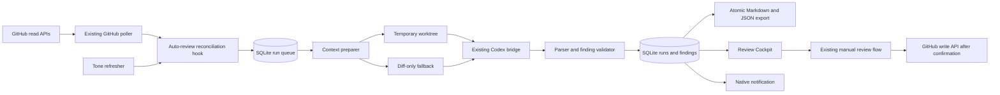

# Automated PR Review Inbox

**Status:** Approved design, pending implementation plan
**Date:** 2026-08-28
**Base:** Reviewly 0.1.8, forked from `volnei/reviewly`
**Target:** Local macOS-first Tauri application

## Summary

Extend Reviewly into a local review cockpit that automatically prepares a private preliminary review whenever GitHub requests a review from the signed-in user. The app polls through Reviewly's existing GitHub worker, runs Codex locally in a read-only sandbox, validates every suggested comment against the current PR head and diff, and stores the result in Reviewly's SQLite database with deterministic Markdown and JSON exports.

The automated path never posts to GitHub. Reviewly's existing manual review controls remain available and unchanged. A review can reach GitHub only after the user opens the app, chooses a verdict, and explicitly confirms the existing submission flow.

## Goals

- Detect open, non-draft pull requests with `review-requested:@me` through the existing 60-second poller.
- Run a preliminary Codex review automatically for each enabled repository.
- Review every newly observed head SHA exactly once, including force-pushes and follow-up commits.
- Use an isolated temporary worktree when a matching local clone is configured.
- Fall back to a clearly labeled diff-only review when no local clone is available.
- Produce concise, paste-ready comments with exact file and line placement.
- Match the user's recent GitHub review voice while enforcing fixed style rules.
- Notify after every completed review, including reviews with no concerns.
- Keep a lightweight, offline-friendly history in SQLite and export every completed run as Markdown and JSON.
- Preserve Reviewly's current architecture and manual review workflow so upstream changes remain practical to merge.

## Non-goals for v1

- GitHub webhooks or a hosted service.
- Codex Scheduled task integration or visibility in the Codex Scheduled interface.
- Automatic GitHub comments, reviews, approvals, or change requests.
- Cloud sync, team collaboration, or shared review history.
- Replacing Reviewly's existing guided tour, chat, layered review, or manual submission features.
- Automatically adding generated findings to a GitHub review draft. The first version provides Copy and Open exact line actions.
- Windows and Linux release work beyond keeping shared code portable where practical.

## User flows

### First-time configuration

1. The user signs into GitHub through Reviewly's existing OAuth device flow.
2. The user selects repositories to watch and maps local clones using Reviewly's current repository settings.
3. The user enables automatic review per repository. Newly discovered repositories default to off.
4. The user selects an app-level Codex model and reasoning effort, with optional per-repository overrides.
5. Reviewly refreshes recent reviews authored by the signed-in GitHub account and builds an editable style profile.
6. The user enables launch at login. Closing the window leaves Reviewly running in the menu bar; choosing Quit stops polling and review execution.

### New review request

1. Reviewly's existing poller detects a new PR in `review-requested:@me`.
2. The coordinator reconciles the pending-review set and reads the current head SHA.
3. If automatic review is enabled and no run exists for that repository, PR number, and head SHA, it creates a queued run.
4. If a mapped clone is available, Reviewly fetches the PR head and creates a detached temporary worktree without switching or modifying the user's working branch.
5. Codex runs in the worktree with read-only sandboxing. The prompt includes PR metadata, the current diff, relevant conversation, the tone profile, and the required output schema.
6. Reviewly validates the response, rechecks the live head SHA, stores the run and findings, writes Markdown and JSON artifacts, and removes the temporary worktree.
7. A native notification appears for every completed review. Selecting the PR in the app opens the prepared review.

### Updated PR head

1. The existing poller emits a change event.
2. Reconciliation sees that the requested PR has a head SHA not present in review history.
3. A new run is queued for that SHA, even if an earlier head was already reviewed.
4. The cockpit keeps both runs and defaults to the newest non-superseded result.

### PR changes during analysis

1. A run starts against head SHA A.
2. GitHub reports head SHA B before finalization.
3. The SHA A run is marked superseded and is not presented as current.
4. Reviewly queues SHA B immediately. It does not notify as though SHA A were a completed current review.

### No concerns

1. Validation accepts a result with an empty findings list.
2. The run is stored as completed with a short `looks good from my side` conclusion.
3. Reviewly sends the same completion notification used for reviews with findings.

### Failure and recovery

1. GitHub failures use bounded retries with backoff and preserve the queued run.
2. Malformed Codex output receives one schema-repair attempt.
3. A persistent failure is stored visibly with a useful error and a Retry action.
4. On wake, reconnect, or launch, reconciliation resumes queued work and recovers stale running records.

## Product behavior

### Review Cockpit

Add a dedicated review-inbox route while retaining Reviewly's existing sidebar and PR detail routes. The route uses the approved three-part layout:

1. Existing application navigation.
2. A queue of assigned PRs and recent review runs.
3. The selected prepared review.

The visual treatment should stay close to a quiet native macOS app:

- Keep the existing macOS vibrancy at the window level.
- Use opaque reading surfaces for comments and evidence.
- Use restrained status color and comfortable information density.
- Avoid decorative dashboards or oversized summary cards.
- Preserve keyboard navigation and resizable panels already used elsewhere in Reviewly.

Each queue row shows repository, PR number, title, author, current head status, context mode, and run state. Completed rows distinguish `findings`, `no concerns`, and `limited context` without turning the list into a severity dashboard.

### Finding presentation

The paste-ready comment is the primary content. Supporting evidence appears below it and may be collapsed. Each finding provides:

- File and exact line or tight line range.
- Diff side for placement.
- Copy action.
- Open exact line action.
- Category and confidence as quiet secondary metadata.
- A short evidence snippet when it materially helps the user verify the comment.

The Open action navigates to Reviewly's current PR diff at the selected line. A GitHub link is also stored for the exact head or base line when a stable line link can be constructed.

### Existing manual submission

The existing review composer and `gh_submit_review` command remain intact. Automated-review modules do not import, receive, or invoke any GitHub mutation command. Moving a generated comment into the existing draft is deliberately outside v1.

This gives the user the current Reviewly workflow when they decide to post:

1. Inspect the prepared review.
2. Open the PR diff.
3. Copy the comments they agree with.
4. Choose Comment, Approve, or Request changes in Reviewly's existing dialog.
5. Confirm submission explicitly.

## Tone and comment rules

### Fixed rules

These rules are part of the application prompt and validator. Automatically learned style and user edits cannot override them.

- Sound like a supportive engineer while remaining direct.
- Lead with the question, concern, or requested verification.
- Do not restate the implementation or explain the author's own code back to them.
- Do not add ceremonial praise or a list of obvious positives.
- Use a practical consequence only when it makes the concern clearer.
- Do not use em dashes.
- Do not use stock AI phrasing or AI attribution.
- Use ordinary punctuation and paragraph breaks when they improve legibility.
- Use a short list only when it materially improves understanding.
- Do not use code fences or inline-code markup in generated review comments.
- Refer to a method by its useful short name instead of reproducing a fully qualified signature.
- Avoid technical exposition when a shorter direct question or observation works.
- When the change is sound, keep the conclusion brief: `looks good from my side`.
- Add an overall review summary only when it contributes information not already present in inline comments.

### Recent-review learning

The tone refresher reads a bounded set of the most recent submitted reviews and inline review comments authored by the signed-in GitHub user. It runs on first setup, on launch when stale, and at most once per 24 hours unless manually refreshed.

The app stores:

- The recent source samples and their GitHub identifiers.
- A hash of the active sample set.
- An automatically generated style profile.
- A separate user-editable override.

When the sample-set hash changes, Reviewly may regenerate the automatic profile. It never overwrites the user's override. The automated-review prompt receives recent examples, the generated profile, the override, and finally the fixed rules in that order.

Empty approval bodies, generated bot reviews, and duplicate comments are excluded from tone samples. The UI shows when the profile was last refreshed and which GitHub account supplied it.

## Architecture



### Reused Reviewly primitives

- `src-tauri/src/workers/github_poll.rs` remains the only periodic GitHub poller.
- `src/app/use-realtime-events.ts` remains the bridge from poller events into the WebView.
- `src-tauri/src/commands/ai.rs` remains the provider process bridge. Automated review uses its Codex path and read-only sandbox.
- `src/stores/local-repos.ts` remains the source for repository-to-clone mappings.
- `src-tauri/src/lib.rs` remains the centralized SQLite migration registry.
- `src/lib/sql-storage.ts` and the existing `reviewly.db` remain the settings and application database.
- `tauri-plugin-notification`, `tauri-plugin-autostart`, the tray worker, close-to-tray behavior, router, sidebar, diff viewer, and review composer remain in place.

### New modules

Keep new behavior isolated so upstream merges remain understandable:

- `src/lib/auto-review/`: domain types, database access, reconciliation, prompt construction, parsing, validation, export models, and tone-profile logic.
- `src/app/use-auto-review.ts`: the single app-wide coordinator hook.
- `src/components/auto-review/`: queue, run detail, finding card, empty, limited-context, and failure states.
- `src/routes/review-inbox.tsx`: the cockpit route.
- `src/stores/auto-review.ts`: global preferences persisted through existing SQL-backed Zustand storage.
- `src-tauri/src/commands/auto_review.rs`: worktree preparation and cleanup, atomic artifact writes, and any filesystem operations that should not live in the WebView.
- `src-tauri/src/clients/github.rs`: read-only queries needed for tone samples or current-head verification when an existing endpoint cannot provide them.

Changes to existing files should be limited to route registration, sidebar navigation, settings controls, migrations, command registration, and the app-wide hook mount.

## Execution model

The main WebView remains loaded when Reviewly is hidden in the menu bar, including when the app starts hidden. The coordinator therefore lives in one app-wide React hook, while each Codex process runs in Reviewly's existing Rust background-task mechanism so navigation does not interrupt it.

The coordinator wakes on:

- Authentication becoming ready.
- App launch.
- `pr:new`.
- `pr:changed`.
- Network reconnect and system wake when detectable.
- A low-frequency reconciliation timer as a safety net.
- Manual Retry.

V1 executes one automated review at a time. This keeps local CPU use predictable, avoids multiple Codex processes competing for context, and simplifies recovery. The database uniqueness constraint makes all wake sources idempotent.

Before spawning Codex, the coordinator persists the run as running. Completion is accepted only for the matching run ID and head SHA. If the WebView reloads, the coordinator checks Reviewly's current AI inflight registry and recovers stale running rows. A result event whose run is no longer current is ignored or marked superseded rather than attached to a newer head.

## Local context

### Worktree mode

When `src/stores/local-repos.ts` contains a valid clone mapping for the PR repository:

1. Verify the clone's remote corresponds to the requested repository.
2. Fetch the PR head into a namespaced local ref.
3. Create a detached worktree under Reviewly's cache directory, keyed by run ID.
4. Run Codex with that worktree as its working directory and with `read-only` sandboxing.
5. Include the authoritative GitHub diff in the prompt even though Codex can inspect the repository.
6. Remove the worktree and temporary ref in a finally-style cleanup path.

The user's active branch, index, untracked files, and existing worktrees are never changed.

### Diff-only mode

When no valid clone exists, the prompt includes PR metadata, changed-file patches, selected conversation context, and tone context. The resulting run is labeled `limited context` in the queue, detail header, notification, Markdown, and JSON.

The app must not imply that diff-only analysis inspected call sites, runtime configuration, generated sources, or invariants outside the supplied patch.

## Structured result contract

Codex returns one JSON object with this semantic shape:

```json
{
  "conclusion": "findings | no_concerns",
  "overallComment": null,
  "findings": [
    {
      "category": "correctness | security | data | concurrency | performance | maintainability | test_coverage | question",
      "confidence": "high | medium | low",
      "path": "src/example.ts",
      "line": 42,
      "endLine": 42,
      "side": "RIGHT",
      "comment": "Could this return before the write finishes and leave the next request reading stale data?",
      "evidence": "The promise is started here but is not awaited before the response returns."
    }
  ]
}
```

The parser accepts only this contract. Markdown fences around the JSON may be stripped, but prose mixed with the result is invalid. A malformed response receives one repair pass with the original output and schema, then fails visibly.

## Finding validation

A finding is stored only when all applicable checks pass:

- Path exists in the current PR diff.
- Line and side map to a commentable line in a parsed diff hunk.
- The line range is ordered and tight.
- Comment is non-empty and does not contain forbidden markup or an em dash.
- Comment does not claim access beyond the run's context mode.
- Evidence is short and corresponds to the selected file or line.
- The PR head still matches the run's head SHA.

Low-confidence findings remain visible but sort after higher-confidence findings. A run may complete with zero findings after invalid suggestions are removed. The result view can show that suggestions were discarded without retaining the raw model response.

Stable GitHub links use the reviewed commit SHA. Right-side findings link to the head; left-side findings link to the base. Reviewly's in-app Open action remains the authoritative placement experience because it can use the parsed PR diff directly.

## Data model

Add forward-only SQLite migrations after the current migration version.

### `auto_review_repo_settings`

- `repo TEXT PRIMARY KEY`
- `enabled INTEGER NOT NULL DEFAULT 0`
- `model_override TEXT`
- `reasoning_override TEXT`
- `created_at INTEGER NOT NULL`
- `updated_at INTEGER NOT NULL`

Local clone paths are not duplicated here. The existing `reviewly.local-repos` setting remains authoritative.

### `auto_review_runs`

- `id TEXT PRIMARY KEY`
- `repo TEXT NOT NULL`
- `pr_id INTEGER NOT NULL`
- `pr_number INTEGER NOT NULL`
- `pr_title TEXT NOT NULL`
- `pr_url TEXT NOT NULL`
- `author_login TEXT NOT NULL`
- `base_sha TEXT NOT NULL`
- `head_sha TEXT NOT NULL`
- `status TEXT NOT NULL`
- `trigger TEXT NOT NULL`
- `context_mode TEXT`
- `provider TEXT NOT NULL DEFAULT 'codex'`
- `model TEXT`
- `reasoning TEXT`
- `conclusion TEXT`
- `overall_comment TEXT`
- `tone_sample_hash TEXT`
- `queued_at INTEGER NOT NULL`
- `started_at INTEGER`
- `completed_at INTEGER`
- `error_code TEXT`
- `error_message TEXT`
- `repair_count INTEGER NOT NULL DEFAULT 0`
- `superseded_by_head_sha TEXT`
- `json_artifact_path TEXT`
- `markdown_artifact_path TEXT`
- `export_error TEXT`
- Unique index on `(repo, pr_number, head_sha)`.
- Indexes on `status`, `queued_at`, and `(repo, pr_number, completed_at)`.

Allowed run states are `queued`, `running`, `completed`, `failed`, and `superseded`.

### `auto_review_findings`

- `id TEXT PRIMARY KEY`
- `run_id TEXT NOT NULL` with cascade delete.
- `ordinal INTEGER NOT NULL`
- `category TEXT NOT NULL`
- `confidence TEXT NOT NULL`
- `path TEXT NOT NULL`
- `line INTEGER NOT NULL`
- `end_line INTEGER NOT NULL`
- `side TEXT NOT NULL`
- `comment TEXT NOT NULL`
- `evidence TEXT`
- `github_url TEXT`
- Unique index on `(run_id, ordinal)`.

### `review_tone_samples`

- `source_id TEXT PRIMARY KEY`
- `source_kind TEXT NOT NULL`
- `repo TEXT NOT NULL`
- `pr_number INTEGER NOT NULL`
- `body TEXT NOT NULL`
- `submitted_at TEXT NOT NULL`
- `fetched_at INTEGER NOT NULL`

### `review_style_profile`

- Singleton `id INTEGER PRIMARY KEY CHECK (id = 1)`.
- `sample_hash TEXT`
- `generated_profile TEXT NOT NULL DEFAULT ''`
- `user_override TEXT NOT NULL DEFAULT ''`
- `generated_at INTEGER`
- `refreshed_at INTEGER`
- `last_error TEXT`

Global preferences such as model, reasoning effort, quiet notification hours, artifact root, and reconciliation cadence remain in the existing SQL-backed Zustand settings pattern.

## Artifacts

SQLite is the source for the app UI. Every completed run is also exported under Reviewly's application-data directory:

```text
artifacts/
  owner/
    repo/
      pull-123/
        <head-sha>/
          review.json
          review.md
```

JSON contains a versioned schema, PR identity, exact SHAs, context mode, model settings, tone-sample hash, conclusion, findings, timestamps, and stable links. Markdown contains the same information in a readable form with paste-ready comments and placement instructions.

Exports are deterministic for a stored run and use temporary-file plus rename semantics. A completed database record remains valid when export fails. The run shows the export error and provides Retry export. Full diffs, repository contents, raw prompts, and raw Codex responses are not retained.

Deleting a run from the app deletes its findings and exported files after explicit confirmation. Compact history otherwise remains until the user deletes it.

## Notifications and quiet hours

Use Reviewly's existing native notification plugin. Send an alert for:

- Completed with findings.
- Completed with no concerns.
- Completed with limited context.
- Failed after retries, with a Retry affordance in the app.

Do not notify for unchanged polling cycles, queued runs, ordinary retries, or superseded results. Quiet hours delay the alert, not the review run. Pending alerts are delivered when quiet hours end, with duplicate suppression by run ID.

## Security and privacy

- Continue using Reviewly's OAuth device flow and OS keychain token storage.
- Keep existing manual write capabilities because Reviewly's manual review workflow remains part of the product.
- Automated-review code uses only read commands and has no dependency on `gh_submit_review`, comment creation, label mutation, reviewer mutation, or merge commands.
- Codex always runs with Reviewly's read-only sandbox flag.
- Temporary worktrees are scoped to Reviewly's cache directory and removed after each run.
- Do not log tokens, raw diffs, complete prompts, review samples, or raw model responses.
- Tone samples and findings stay local in SQLite and local artifacts.
- No telemetry or Reviewly-hosted service is introduced.

## Error handling and state recovery

- GitHub rate limits and transient failures use the existing bounded retry behavior where available.
- Context preparation failures fall back to diff-only only when the GitHub diff remains complete enough to review; otherwise the run fails.
- Codex timeout and process errors fail the run with an actionable message.
- A malformed response gets one repair attempt and no unbounded model loop.
- Cleanup runs after success, failure, cancellation, or supersession. Orphan cleanup also runs on launch.
- Running rows without a matching Rust inflight task are recovered on launch. They return to queued once, then fail if the same recovery condition repeats.
- Artifact export failure does not discard a successfully validated review.
- A database migration failure prevents the feature from starting and leaves existing Reviewly data untouched.

## Testing strategy

Introduce focused tests around the new pure domain modules instead of relying only on end-to-end checks.

### TypeScript tests

- Reconciliation deduplicates `(repo, PR, head SHA)`.
- A new head SHA queues a new run.
- Disabled and newly discovered repositories do not queue.
- Stale and removed assignments do not start.
- Structured-output parsing and the single repair boundary.
- Exact diff-line and side validation.
- Fixed tone rules, including em dash and markup rejection.
- No-concerns completion.
- Superseded-head handling.
- Export model determinism.
- Quiet-hour notification deduplication.

### Rust tests

- Safe worktree naming and path containment.
- Remote/repository identity validation.
- Cleanup on success and failure.
- Atomic artifact replacement.
- Codex argument construction always includes read-only sandboxing.

### Integration tests

- SQLite migrations from the current Reviewly schema.
- Full coordinator flow with fake GitHub data and a fake Codex result.
- Malformed result followed by a successful repair.
- Mid-run head change.
- Offline launch followed by reconnect.
- App restart with queued and stale-running jobs.
- Completion and failure notifications.
- Static dependency test ensuring auto-review modules do not reference GitHub mutation command names.

Existing CI continues to run typecheck, lint, frontend build, and Cargo check. The implementation adds the chosen TypeScript test runner and `cargo test --locked` to CI.

## Rollout

1. Add schema, domain types, settings, and repository opt-in controls behind an `automatic reviews` feature flag that defaults off.
2. Add reconciliation, fake-Codex tests, run history, and the cockpit UI.
3. Add local worktree context and diff-only fallback.
4. Add tone refresh and editable profile.
5. Add artifact export, notifications, failure recovery, and orphan cleanup.
6. Run the app locally against a test repository with automatic posting structurally absent.
7. Enable one repository, compare generated comments against recent authored reviews, and tune only the prompt/profile boundaries that fail the agreed style.
8. Enable additional repositories individually.

## Acceptance criteria

- Enabling a repository causes a newly assigned PR to receive one local review run for its current head SHA without user interaction.
- Updating the PR queues one and only one run for the new head SHA.
- Closing the window does not stop polling or an active review; choosing Quit does.
- No automated path invokes a GitHub write endpoint.
- Every stored finding maps to an exact current diff line and offers Copy and Open exact line.
- Runs with no findings complete and notify normally.
- The generated comments satisfy the fixed style constraints and use recent authored reviews as tone context.
- Worktree mode never changes the user's active clone state and always cleans up temporary worktrees.
- Diff-only results are visibly labeled limited context.
- Completed runs survive app restart and export deterministic Markdown and JSON.
- Failures, superseded heads, export errors, and recovery states are visible and actionable.
- Existing manual Reviewly submission remains available only through explicit user action and confirmation.
